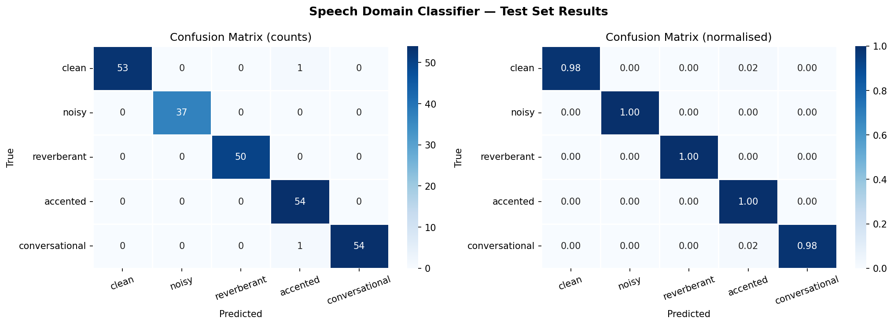
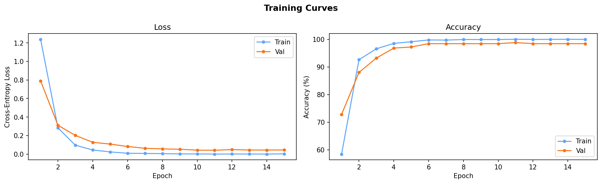
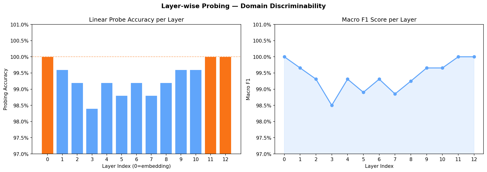
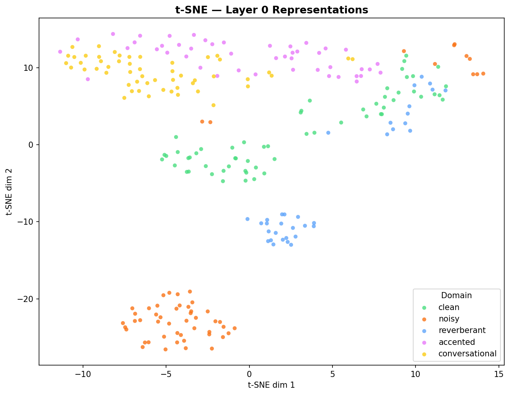

# Speech Domain Classifier

One of the most common failure modes in speech processing is a model trained on clean, studio-quality audio completely falling apart the moment it encounters real-world conditions. Before you can fix that, you first need to know what kind of acoustic environment you are dealing with. That is exactly what this project does.

Given a raw audio file, this classifier tells you which of five acoustic domains it belongs to — clean, noisy, reverberant, accented, or conversational — using a fine-tuned Wav2Vec 2.0 backbone trained on real speech data from LibriSpeech and the NOIZEUS corpus.

## Results

Evaluated on a held-out test set of 250 samples balanced across all five domains.

| Metric | Score |
|---|---|
| Test Accuracy | 99.2% |
| Macro F1 | 0.9927 |
| Weighted F1 | 0.9920 |

Per-class breakdown:

| Domain | Precision | Recall | F1 |
|---|---|---|---|
| clean | 1.0000 | 0.9815 | 0.9907 |
| noisy | 1.0000 | 1.0000 | 1.0000 |
| reverberant | 1.0000 | 1.0000 | 1.0000 |
| accented | 0.9643 | 1.0000 | 0.9818 |
| conversational | 1.0000 | 0.9818 | 0.9908 |

Noisy and reverberant domains both hit perfect F1. The only errors in the entire test set were two misclassifications — one clean sample predicted as accented, and one conversational sample predicted as accented. Everything else was correct.





## Layer-wise Probing

Beyond classification accuracy, I ran probing experiments to understand where inside the Wav2Vec 2.0 transformer domain information actually lives. For each of the 13 layers — the embedding layer plus 12 transformer layers — I froze the entire backbone, extracted the representations, mean-pooled over time, and trained a simple logistic regression on top. The probe accuracy at each layer tells you how much domain-discriminative information is present there without any task-specific fine-tuning signal.

The result is striking. Domain information achieves 100% linear separability at layer 0, meaning the raw CNN embedding output already perfectly separates all five acoustic domains before a single transformer layer has even processed the signal. Accuracy dips slightly through the middle layers, reaching a low of 98.4% at layer 3, then climbs back to 100% at layers 11 and 12.

This tells you something important: acoustic domain properties like noise, reverberation, and speaking style are captured right at the feature extraction stage and do not depend on deep contextual processing. If you were building a domain adaptation system on top of this backbone, you would not need to go deep into the network to find the domain signal — it is already there at the surface.





The t-SNE visualisation of layer 0 representations shows exactly this — five completely distinct clusters with near-zero overlap, which is why a linear probe achieves perfect accuracy there.

## Dataset

The dataset was constructed from a combination of real recordings and acoustic simulation, balanced at 500 samples per class.

**Clean** — LibriSpeech dev-clean. Real human speech recorded in controlled acoustic conditions across multiple speakers and recording sessions.

**Noisy** — NOIZEUS corpus. 30 IEEE sentences produced by three male and three female speakers, corrupted by eight real-world noise types from the AURORA database: suburban train, babble, car, exhibition hall, restaurant, street, airport, and train station noise. 500 samples drawn from across all noise types and SNR levels.

**Reverberant** — LibriSpeech test-clean convolved with synthetic room impulse responses. Room decay times (T60) were sampled uniformly between 0.3 and 1.2 seconds, covering environments from small offices to large halls.

**Accented** — Synthesized using espeak-ng across five English accent variants: American, British, Caribbean, Scottish, and Received Pronunciation. 500 samples across a vocabulary of 100 sentences.

**Conversational** — Synthesized using espeak-ng with faster speech rates (160-200 WPM), varied pitch, and sentence structures that include disfluencies, hedges, and informal phrasing typical of spontaneous speech.

## Model

The backbone is facebook/wav2vec2-base, a 94M parameter transformer pretrained on 960 hours of LibriSpeech via self-supervised masked speech prediction. For fine-tuning, the CNN feature extractor and bottom 8 transformer layers are frozen. Only the top 4 transformer layers and the classification head are trained, which keeps the low-level acoustic representations intact while allowing the upper layers to specialise for domain classification.
```
Raw waveform (16kHz)
      ↓
Wav2Vec2 CNN feature extractor     frozen
      ↓
Transformer layers 0 to 7          frozen
      ↓
Transformer layers 8 to 11         fine-tuned
      ↓
Mean temporal pooling
      ↓
LayerNorm → Dropout(0.1) → Linear(768 → 256) → GELU → Dropout(0.1) → Linear(256 → 5)
      ↓
Domain label
```

Trainable parameters: 33.3M out of 94.6M (35.2%)

## Training

15 epochs on a single NVIDIA T4 GPU, approximately 24 minutes total. The model reached 88% validation accuracy by epoch 2 and converged to 98.8% by epoch 11 where the best checkpoint was saved. AdamW optimiser with separate learning rates for the backbone (3e-6) and classification head (3e-5), cosine schedule with linear warmup over the first 10% of steps, mixed precision fp16 throughout.

## Tech Stack

Python, PyTorch, Wav2Vec 2.0, HuggingFace Transformers, LibriSpeech,
NOIZEUS, Librosa, scikit-learn, torchaudio, espeak-ng, matplotlib, seaborn

## Run it yourself

The full experiment is self-contained in the notebook. Open it in Colab, switch to a T4 GPU runtime, and run all cells from top to bottom. It handles everything — downloading LibriSpeech, cloning the NOIZEUS corpus from GitHub, generating the accented and conversational domains, training, evaluation, probing, and all plots.

[](https://colab.research.google.com/github/Harie1316/Speech-Domain-Classifier/blob/main/notebooks/Speech-Domain-Classifier.ipynb)
